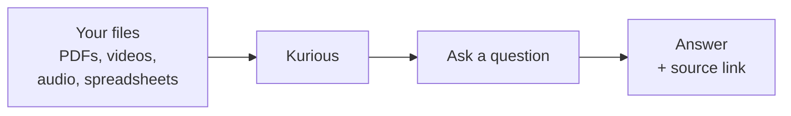
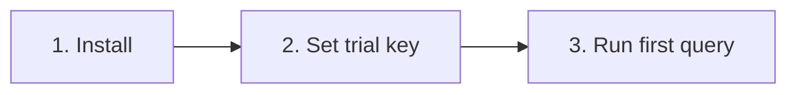
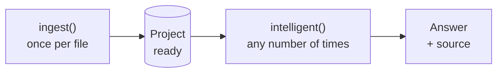

<div align="center">

# Kurious

**Ask any question across PDFs, videos, spreadsheets, and recordings. Get a grounded answer in one call.**

[Quickstart](#getting-started) · [Examples](examples/) · [Discord](https://discord.gg/aintropy-community) · [Discussions](https://github.com/Kurious-AI/getting-started/discussions)

</div>

---

## What is Kurious

A single tool that reads all your unstructured content and answers questions in plain English. Every answer links back to the source.



---

## Why Kurious

| Without Kurious | With Kurious |
|---|---|
| Pick a database, a model, a chunker. Wire them up. Maintain them. | One package. A few lines of code. |
| Separate code paths for documents, spreadsheets, and video. | One call, routed for you. |
| Bolt on OCR, transcription, and frame extraction. | All formats handled. |
| Build citations from scratch. | Citations by default. |
| Run and scale servers. | Hosted. |

---

## What you can build

| Use case | Example question |
|---|---|
| Internal Q&A | "What is our PTO policy for new hires?" |
| Meeting search | "What did the customer say about renewal in March?" |
| Contract review | "Which contracts mention exclusivity?" |
| Cross-format research | "Summarize Q3 using filings and call recordings" |
| Side-by-side comparison | Same question, twenty cities |

---

## Prerequisites

| Requirement | How to check |
|---|---|
| Python 3.10 or newer | Run `python --version` in your terminal |
| A terminal app | Mac: Terminal. Windows: PowerShell |
| About 10 minutes | For Explore Mode |

> [!NOTE]
> No Docker. No servers. No other accounts.

---

## Getting started

### Pick a mode

| | **Explore Mode** | **Builder Mode** |
|---|:---:|:---:|
| **Goal** | Try Kurious on sample data | Search your own files |
| **Time** | ~60 seconds | ~30 minutes |
| **Setup** | Trial key | Setup wizard |

Start with Explore Mode. Move to Builder Mode when you are ready.

---

### Explore Mode



**1. Install**

```bash
pip install artifacts-keyring
pip install "aintropy>=0.5.5,<0.6" --index-url "https://pkgs.dev.azure.com/AIntropy-DevOps/Kurious-SDK/_packaging/kurious-sdk-pypi/pypi/simple/"
```

> [!TIP]
> Hit `401 Unauthorized`? See [Troubleshooting](#troubleshooting).

**2. Set your trial key**

```bash
export KURIOUS_API_KEY="trial_REPLACE_ME"
```

**3. Save this as `first_query.py` and run `python first_query.py`**

```python
import os
from aintropy import AIntropy

client = AIntropy(api_key=os.environ["KURIOUS_API_KEY"])

louisville = next(
    p for p in client.projects.list().projects
    if "louisville" in p.name.lower()
)

result = client.search.intelligent(
    project_id=louisville.id,
    query="What did the council decide about affordable housing?",
    mode="quick",
)

print(result.answer)
```

#### Sample collections you can search

| Collection | Contents |
|---|---|
| Louisville Council | City council video |
| Seattle Council | City council video |
| NJ Open Data | Government spreadsheets |
| Legal Video Archive | Court recordings |
| ChemRAG | Chemistry research |

---

### Builder Mode


**1. Run the setup wizard**

```bash
kurious init
```

It asks for your name, email, organization, and a project name. Your API key is saved automatically.

**2. Load your files**

```python
import os
from aintropy import AIntropy

client = AIntropy(api_key=os.environ["KURIOUS_API_KEY"])
project_id = client.projects.list().projects[0].id

client.projects.ingest(project_id, "./my-docs/", wait=True)
```

**3. Ask a question**

```python
result = client.search.intelligent(
    project_id=project_id,
    query="Your question here"
)
print(result.answer)
```

#### Supported file types

| Documents | Spreadsheets | Images | Audio | Video |
|:---:|:---:|:---:|:---:|:---:|
| PDF, DOCX, TXT, MD | CSV, Parquet | PNG, JPG | MP3, WAV | MP4 |

> [!IMPORTANT]
> A 60-minute video takes about 10 to 15 minutes to load. Documents are usually ready in seconds.

---

## The SDK in two commands

Everything you do with Kurious uses one of these two.



### Load files

```python
client.projects.ingest(project_id, path)
```

| Input | Output | How often |
|---|---|---|
| A folder or a single file | Files ready to search | Once per file |

### Ask a question

```python
client.search.intelligent(project_id=..., query="...")
```

| Input | Output | How often |
|---|---|---|
| A question in plain English | An answer plus its source | As often as you want |

---

## Docs

| | |
|---|---|
| API docs | https://kurious.aintropy.ai/api/docs |
| SDK reference | Coming soon |
| Long-form guide | See engine guide |

---

## Examples

Twelve runnable scripts in [`examples/`](examples/), each about 15 lines.

| # | Script | What it shows |
|---|---|---|
| 01 | `01_hello_search.py` | First query |
| 02 | `02_list_projects.py` | All sample projects |
| 03 | `03_get_project_info.py` | Inside a project |
| 04 | `04_search_videos.py` | Find a clip in a video |
| 05 | `05_filter_by_date.py` | Narrow by date |
| 06 | `06_find_a_person.py` | Mentions of a speaker |
| 07 | `07_cross_modal.py` | Video and PDF together |
| 08 | `08_quick_vs_deep_think.py` | Fast vs. thorough |
| 09 | `09_compare_projects.py` | Two projects, side by side |
| 10 | `10_show_citations.py` | All source spans |
| 11 | `11_stream_answer.py` | Token-by-token streaming |
| 12 | `12_see_routing_decision.py` | Which approach Kurious used |

```bash
python examples/01_hello_search.py
```

---

## Troubleshooting

<details>
<summary><b><code>401 Unauthorized</code> on install</b></summary>

Get a token from [dev.azure.com/AIntropy-DevOps](https://dev.azure.com/AIntropy-DevOps): avatar, then **Personal access tokens**, scope **Packaging (Read)**. Then:

```bash
export AZURE_DEVOPS_EXT_PAT="<your-token>"
```

Rerun the install.
</details>

<details>
<summary><b><code>403 Forbidden</code> on a project</b></summary>

Your key is not scoped to that project. Trial keys work on sample projects only. Keys from `kurious init` work on the project they were created with.
</details>

<details>
<summary><b>New project, empty search results</b></summary>

Run once after creating the project:

```python
client.projects.update_config(project_id, search_mode="kg_unstructured")
```
</details>

<details>
<summary><b>Ingest completed but search is empty</b></summary>

Check the index step:

```python
client.projects.get_step_timings(project_id)
```

If `index` shows `count=0`, give it another minute.
</details>

<details>
<summary><b>Video search slow on first query</b></summary>

Cold cache. Next queries are fast.
</details>

<details>
<summary><b>Reporting a bug</b></summary>

[Open an issue](https://github.com/Kurious-AI/getting-started/issues/new), pick **Bug report**, include SDK version (`pip show aintropy`), project ID, the call, and the error.
</details>

---

## Roadmap

New features land here next sprint.

---

## Support

| Need | Where |
|---|---|
| Found a bug | [Open an issue](https://github.com/Kurious-AI/getting-started/issues/new) |
| Question or show-and-tell | [Discussions](https://github.com/Kurious-AI/getting-started/discussions) or [Discord](https://discord.gg/aintropy-community) |
| Direct help | know@aintropy.ai |

---

## License

Apache 2.0. See [LICENSE](LICENSE).
